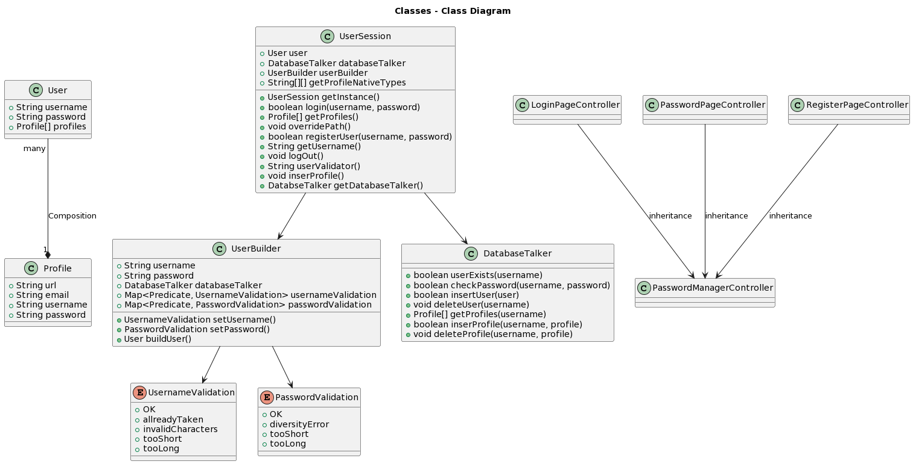

# Release 2

## New features

<!-- A quick summary of the new features in this release. -->
As of Release 2, we have now a functional web application that allows users to create an account and password.
The application also allows users to create and view their passwords in a list format. Altough the application is not yet fully
functional, where it is not yet possible to delete and edit passwords nor it is a application that encrypts passwords
safely, it is still a great step forward in the development of the application. We have also splitted the sourcecode
into diffrent files and modules, which makes it easier to work with the code.

---

## Architecture

We have now split the application into tree layers, Core,  UI and Presistence. The Core layer contains the logic of the application and the UI layer contains the user interface.
We do have a third layer, which is the Prestistence layer, but we have not yet seperated it from the core layer. The prestistence layer will be seperated in the next release, where we will also
implement the functionality to create, edit and delete passwords. The prestistence we have chosen to use is a JSON file,
which will be stored on the users computer. The reason for this is that we want to keep the application as simple as
possible, and we do not want to use a database. Jackson is the library we use to convert the JSON file to Java objects
and vice versa. The architecture of the application is shown in the image below.

### Core

The main class in the core module is the UserSession class. The UserSession class delegates all the requests from the
UI to either itself, or to other classes. The UserBuilder class contains methods to validate username and password for
a new user, it does this by checking against a series of predicates and returns a response code.
UserSession then takes this response code and sends an appropriate string with and response messsage. this being "OK" if all checks were passed.
The User and Profile classes serves purely as dataclasses and does not have any functionality besides getters and setters.

### Persistence

All users, and their individual data, are stored within a single JSON file. We used the Jackson library to
serialize and deserialize Java objects to JSON strings and vice versa. The JSON file is stored in the
**localpresistence/src/main/resources/localpresistence/folder**.

### UI

We have created a desktop application using JavaFX. The UI is divided into three main parts, the login page, the
register page and the password page. We have made a controller and a fxml-file for each page and a main controller to
switch between the pages (*PasswordManagerController.java*).

We have redisigned the Figma design of our app to make it more user friendly and consistent. The updated design can be
seen in the applicion description [here](../../passwordManager/readme.md).

---

## Code quality

For this release we implemented a few Maven plugins to ensure better code quality. We used the following tools to
improve our code quality:

### Jacoco

We use Jacoco to check the test coverage of our project.
After Jacoco has been run we are left with a html report where
we see the percentage of the test coverage in each module.
If the test coverage of a class was under 60%, it would not be sufficient
for release 2. If it was between 60% and 80%, it would be sufficient,
but it would result in a warning.

<!--mvn kommando for å kjøre jacoco-->

### Checkstyle

We use Checkstyle to make sure that our code adheres to a certain coding standard. Our configuration file can be found
in the **/passwordManager/config/checkstyle** folder. We use the Google Java Style Guide as our coding standard.

<!--mvn kommando for å kjøre checkstyle-->

<!--### Spotbugs

We use Spotbugs to analyze our Java code for bugs.-->

---

## Workflow and workhabits

We have used the GitLab issue tracker to keep track of our issues and milestones. We have also used the GitLab CI/CD
**pipeline** to run our tests and check our code quality so that we cannot merge without a quality check. We have
also used the GitLab merge request feature to ensure that we do not push directly to the master branch.

Pair programming is an essential part of our workflow, we pair program to ensure that we understand the code and to
learn from each other. It is also helpful to cooperate with someone else when solving a difficult problem.

We have two weekly meetings where we discuss our progress and what we need to do to finish the project, those meetings
also consists of us coding together for several hours. If we see that two times a week is not enough, we will add more
meetings. To ensure that most of us is present at the meetings, we have made an contract that we gives fines to each
person that are late to the meetings, this has worked very well since it is an more motivating factor to be on time to
the meetings.

## Pipeline Jobs

In this repo we have a pipeline that runs a series of jobs to ensure that only valid code is merged into the main branch.
The jobs run an assortment of maven goals and will give feedback if something goes wrong. The following jobs are run:

- `build`
  - `validate` - validates the project is correct and all necessary information is available. Merge blocked if this fails.
  - `compile` - compiles the source code of the project. Merge blocked if this fails.

- `test`
  - `test` - runs all the tests in the project. Merge blocked if this fails.
- `test-coverage`
  - `test-coverage-minimum` - runs all the tests in the project and checks if the test coverage is above 60%. Merge blocked if this fails.
  - `test-coverage-80` - runs all the tests in the project and checks if the test coverage is above 80%. Merge warning if this fails.
- `quality`
  - `checkstyle` - runs checkstyle on the project. Merge warning if this fails.

- `clean_install` - builds the project and installs it in the local repository. Merge blocked if this fails.

This pipeline is run on every merge request to the main branch. The pipeline can be found [here](../../.gitlab-ci.yml). These checks are necessary to ensure that only valid code is merged into the main branch. This is important because we want to ensure that the code is of high quality and that it works as intended. If the code is not of high quality, it will be harder to maintain and it will be harder to add new features. If the code does not work as intended, it will be harder to debug and it will be harder to find the bug. This will result in a lot of wasted time and it will be harder to finish the project on time.
