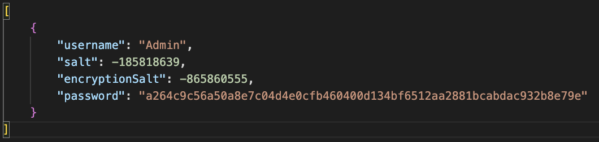
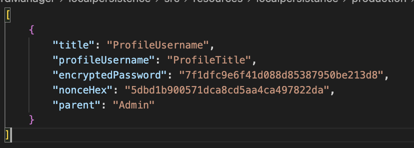
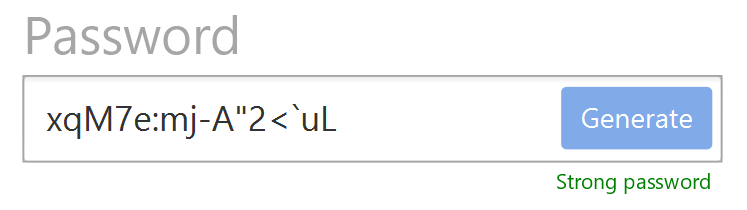

# Release 3

## New features

For this release we have created a REST-API with springboot and implemented the functionality to copy passwords and delete profile. We have also implemented the functionality to encrypt and decrypt passwords. We have also implemented a new architecture, where we have seperated the persistence layer from the core layer. The new architecture is shown in the image below.

## Architecture

The complete architecture of the project is documented in the project-architecture folder's [readme file](../project-architecture\readme.md).

The new architecture consists of a server and a client. The server application consists of four modules: core, restserver, encryption and localpersistence. The client application consists of ui and client module. The user interacts with the application trough the ui, ui tells the client module to send requests to the server application. client.restTalker creates the request with the proper format and sends them to the server application. At the server, each requests are handled and the appropriate actions are taken before sending the response data back to the client application.

## Updated modules

### Restserver

For this release we implemented a REST-API with spring-boot. The server is set up using spring in the new restserver module. This module is dependent on localpresistence, core & encryption and handles requests from a new client module. This makes ui and core independet, and the data between them are handled by the client module (Data access layer) and the restserver (Service layer).

We have chosen to use Spring because Spring is widely used by other java developers and therefore it is well documented. Spring Boot made it easier to set up the Spring server.

### Encryption

The encryption module contains the encryption algorithm and the hashing algorithm. All UserPasswords are stored as salted hashes so a database leak won´t compromise are users passwords. All profilePasswords are encrypted using a hash of their users passwords as a key, again this means that no stored data can be used to access users passwords. We have not however configured spring to use TLS, so our users passwords are not really safe.

- The encryption utilises an implementation of the TwoFish block cipher algorithm and cipher block chaining. The encryption takes in an arbitrary length byte array and encrypts it using a key, it can then later be decrypted using the same key. The encryption also uses a "nonce" or "number used once" to introduce more confusion into the encryption. This is done so the same plaintext won't be encrypted to the same ciphertext.

- The hash algorithm takes in an arbitrary length byte array and produces the hash for the data, the hashing algorithm is an implementation of the SHA256 algorithm.

### Local Persistence

The new local persistence uses two tables in seperate files, each profile now has a reference to its parent user instead of being nested inside its parent user. This is similar to a foreign key in more traditional database systems like SQL.

- Example of a stored user in our database. The salts are used to generate different hashes, and the password is hashed

- Exaample of a stored profile in our database. The password is encrypted using the parent users password. Nonce is used in the encryption(see encryption)
- 

### Core

Core has changed, and consists of the dataclasses User and Profile, and the userbuilder class. 

### Client

<!-- Changes in client -->
A new client module has been created which mostly serves to send http requests to the server application. The RestTalker class gets called from the ui and creates an appropriate GET/POST request which it send to the server. Once the response returns from the serveside application, and if the request was served successfully the data gets returned to the ui to get displayed to the user. If the user has logged into the account, a RestTalker instance also stores the username and password of the logged in user. 

- The module also has a password class, which generates hard to guess passwords, and can give a difficulty rating for passwords. 

### UI

<!-- Changes in UI -->

The UI has had a few functionalities added, as a few changes in the design, as well as a few bug fixes:

- The password field when creating a new profile now shows how strong the password is, ranking from weak to medium to strong. See image below.

- When adding a new profile, the user can now choose to generate a password for them, or write their own. The generated password will always be rated as strong. See image above.

- Copy and delete icons have been added to the profile list. The copy icon copies the password to the clipboard, and the delete icon deletes the password from the list. See image below.

- When either the title, username or password of a profile is too long, it will be cut off and made vertically scrollable.

- In the previous release, the exit "add profile overlay" button was not visible on all operating systems. This has been fixed, by changing from a X character to a X svg icon. See image below.

- Other minor improvements and bug fixes was also made, such as the window beeing blurred when the "add profile overlay" is visible, and the possibility to mark the text of the profiles.

## Code quality plugins

For this release we implemented a new Maven plugin to ensure better code quality.

A more in-depth description of the Maven plugins we have used in the project is in the [workflow.md](../workflow.md) file.

### Spotbugs

Spotbugs is a static analysis tool that looks for bugs in Java code. We have Spotbugs running in every module, so that the project as a whole is bug free. <!-- Rephrase -->

## Testing

<!-- Changes in testing -->

<!-- improved testing, ui testing -->
Unit tests are now actually unit tests, where each unit is tested independently. We have also added integration testing which tests that the whole architecture works together. Jacoco also checks all modules for code coverage, and our tests test at least 80% of all modules.

## Pipeline Jobs

For this release we still use the GitLab CI/CD pipeline, but we have added a few new jobs to the pipeline.

List of stages witch jobs, and their order of execution:

- `build`
  - `validate` - validates the project is correct and all necessary information is available. Merge blocked if this fails.
  - `compile` - compiles the source code of the project. Merge blocked if this fails.

- `test`
  - `test` - runs all the tests in the project. Merge blocked if this fails.

- `coverage`
  - `test-coverage-minimum` - runs all the tests in the project and checks if the test coverage is above 60%. Merge blocked if this fails.
  - `test-coverage-80` - runs all the tests in the project and checks if the test coverage is above 80%. Merge warning if this fails.

- `quality`
  - `checkstyle` - runs checkstyle on the project. Merge warning if this fails.

- `bugs` *(new)*
  - `spotbugs` - runs spotbugs on the project. Merge warning if this fails.

[This](../../.gitlab-ci.yml) pipeline still run on every merge request to the master branch.

## Workflow

The complete documentation for the project workflow is in the [workflow.md](../workflow.md) file.