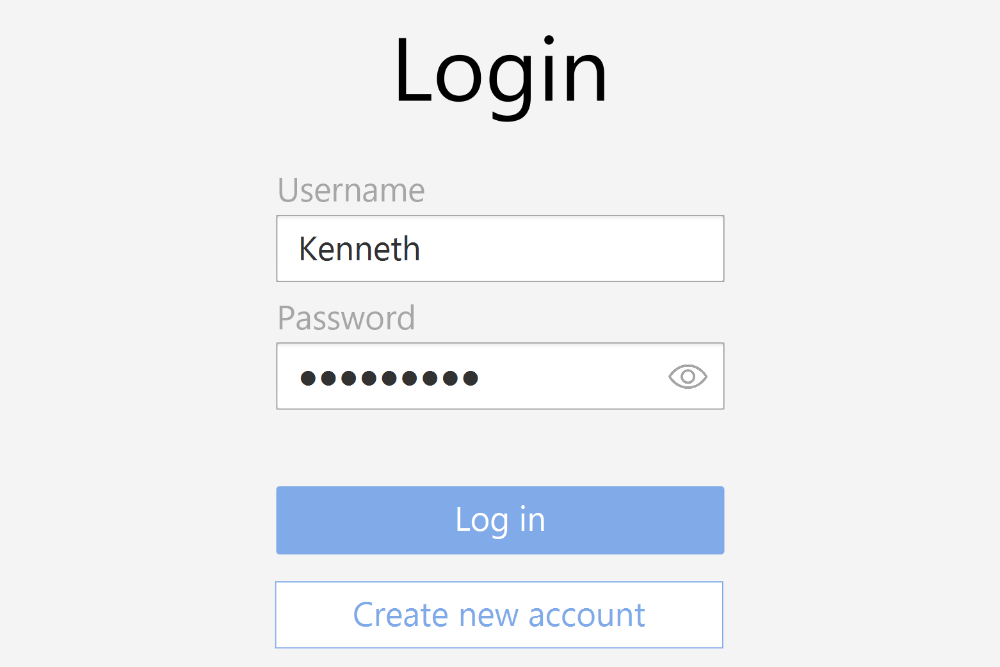
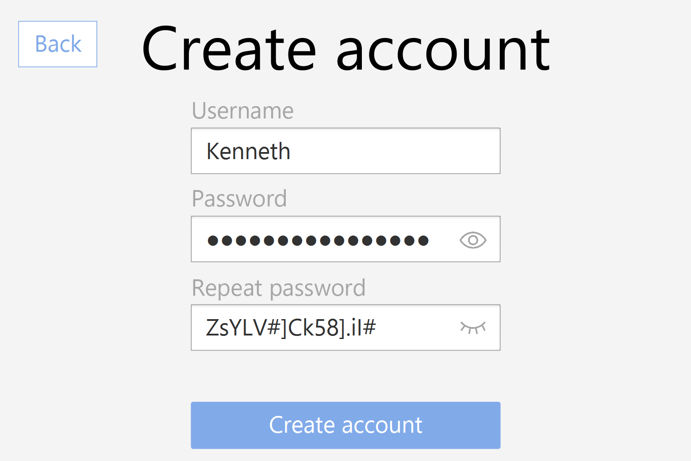
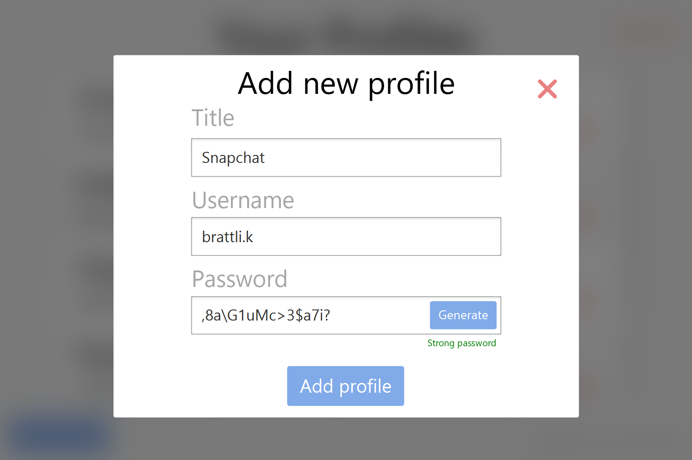

# Application description

This is a simple Password Manager where users can store and access their profiles for all types of places where you need an username & password. We encrypt passwords to protect our users.

## Login page

On the application, the user will first be met with a login page. There they can either log in to an existing account or create a new one.

In all password inputs, the user will be able to enable a toggle to show the password they are typing.

## New account page

When you create a new account, you need to submit an unique username, and a password that match the password requirements.

## Main page

When you are logged in to the application, you will see all the profiles you have created. You can create a new profile or access an existing one.

There are also the possibility for deleting and adding profiles, and copying passwords to the clipboard.

## Adding a new password profile

When adding a profile. You have to give it a title, specify your username and password. The password can either be written or generated for you. The gray bar underneith the password field is a progress bar that shows how strong your password is.

