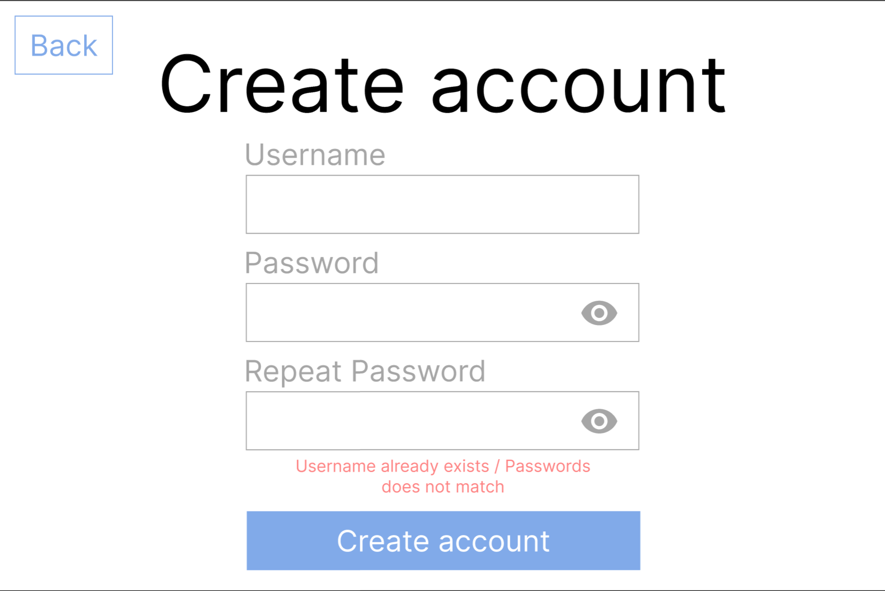
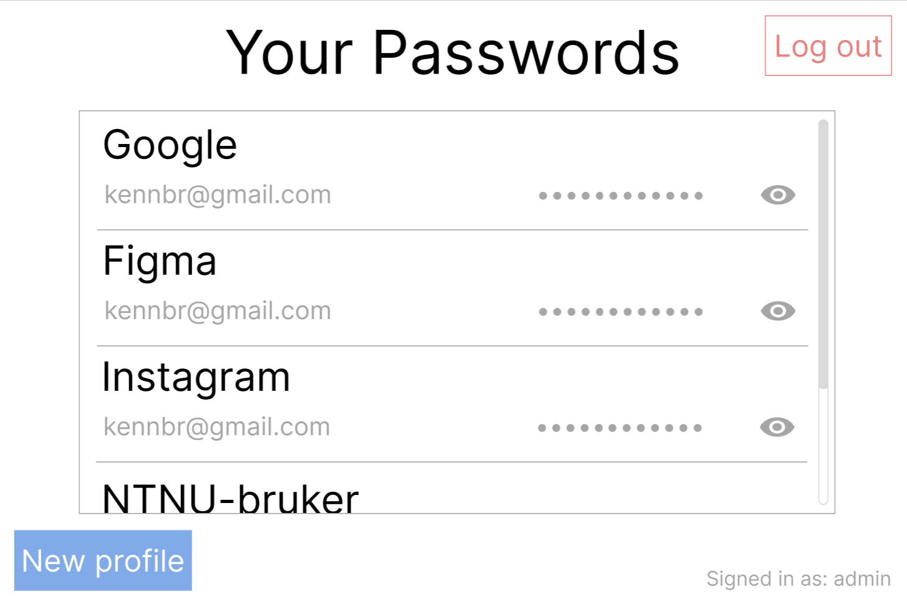

# Application description

This is a simple Password Manager where users can store and access their passwords.

The passwords will be stored locally, but both the users password for the application and all their stored passwords will be encrypted.

## Login page

On the application, the user will first be met with a login page. There they can either log in to an existing account or create a new one.

In all password inputs, the user will be able to enable a toggle to show the password they are typing.

## New account page

When you create a new account, you need to submit an unique username and a password that match the requirements.

## Main page

When you are logged in to the application, you will see all the profiles you have created. You can create a new profile or access an existing one.

There are also the possibility for deleting, adding and copying passwords to clipboard.

## Adding a new password profile

When adding a profile. You have to give it a title, specify your account and password. The password can either be written or generated for you. The gray bar underneith the password field is a progress bar that shows how strong your password is.

