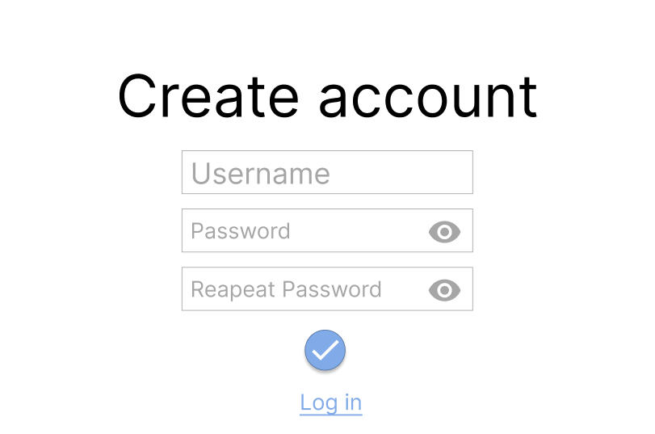
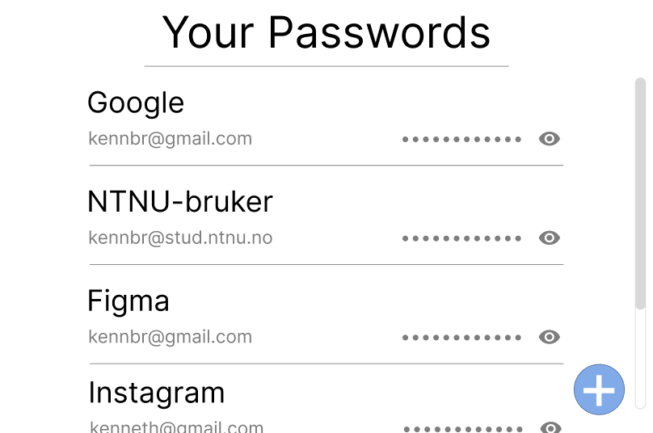

# Application explained
This is a simple Password Manager where users can store and
access their passwords for various websites. 

The passwords will be stored locally, but both the users password for the 
application and all their stored passwords will be encrypted.

## Login page
On the application, the user will first be met with a login page.
There they can either log in to an existing account or create a new
one. 

When you register, you only need to submit a unique username and a password.

## Main page
When you are logged in to the application, you will see all the websites you have
stored a password for.

There will also be possibility for deleting, adding and copying passwords to clipboard.

## Create new password

When adding a password. You have to give it a title, specify your account and password.
The password can either be made by the user or randomly generated.

 